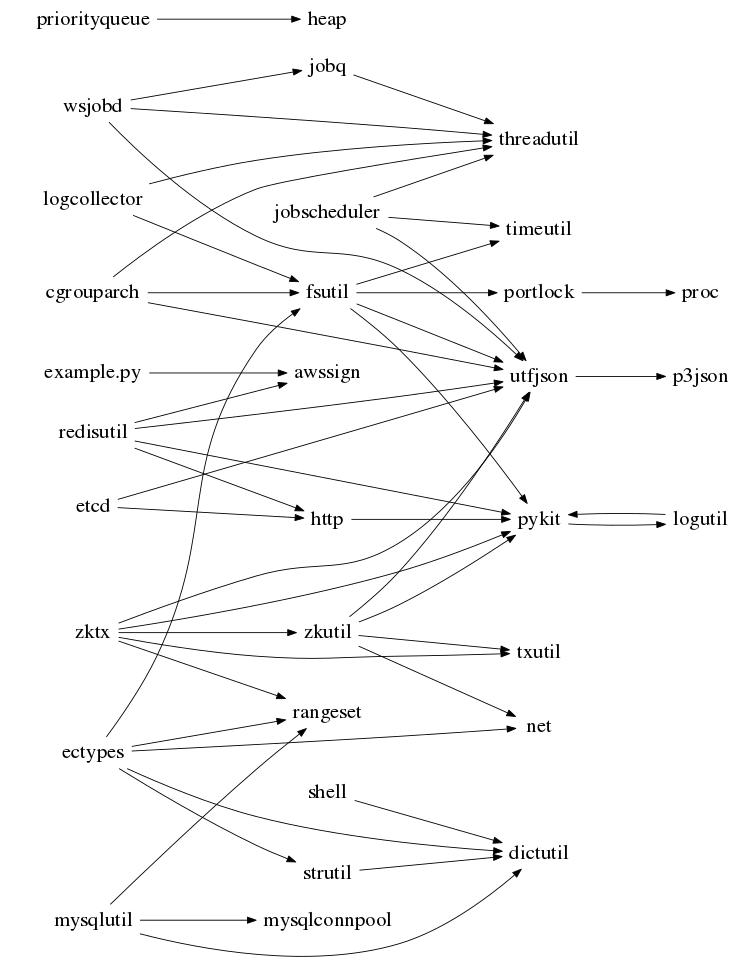

<!-- START doctoc generated TOC please keep comment here to allow auto update -->
<!-- DON'T EDIT THIS SECTION, INSTEAD RE-RUN doctoc TO UPDATE -->
#   Table of Content

- [Name](#name)
- [Status](#status)
- [Description](#description)
  - [Module List](#module-list)
- [Install](#install)
- [Usage](#usage)
- [Configuration](#configuration)
  - [Supported config](#supported-config)
- [Test](#test)
- [For developer](#for-developer)
  - [Config](#config)
    - [How it works](#how-it-works)
    - [How to use](#how-to-use)
- [Author](#author)
- [Copyright and License](#copyright-and-license)

<!-- END doctoc generated TOC please keep comment here to allow auto update -->


#   Name

pykit:
A collection of python libs those are used in project s2: Storage-Service at
baishancloud.com

#   Status

This library is in beta phase.

It has been used heavily in our object storage service, as a foundamental
library of our devops platform.

#   Description

##  Module List

There is a `README.md` for each module.

| name                           | description                                                                           |
| :--                            | :--                                                                                   |
| [argchecker](argchecker)       | Validates arguments against the schema                                                |
| [aws](aws)                     | AWS error codes and so on                                                             |
| [cacheable](cacheable)         | Cache data which access frequently                                                    |
| [cachepool](cachepool)         | Reusable object cache in process                                                      |
| [cluster](cluster)             | Some helper function for the server in a cluster                                      |
| [daemonize](daemonize)         | Start, stop or restart a daemon process                                               |
| [dictutil](dictutil)           | Dictionary helper utility                                                             |
| [etcd](etcd)                   | etcd client                                                                           |
| [fsutil](fsutil)               | File-system Utilities                                                                 |
| [heap](heap)                   | Min heap                                                                              |
| [http](http)                   | HTTP/1.1 client                                                                       |
| [humannum](humannum)           | Convert number to human readable number string                                        |
| [jobq](jobq)                   | Process serial of input elements with several functions concurrently and sequentially |
| [logutil](logutil)             | Utility functions to create logger or make log message                                |
| [mime](mime)                   | Utility functions to handle mime type                                                 |
| [modutil](modutil)             | Submodule Utilities                                                                   |
| [mysqlconnpool](mysqlconnpool) | Mysql connection pool with MySQLdb in python                                          |
| [mysqlutil](mysqlutil)         | Mysql related datatype, operations                                                    |
| [net](net)                     | Network utility                                                                       |
| [portlock](portlock)           | cross process lock                                                                    |
| [priorityqueue](priorityqueue) | Priority queue                                                                        |
| [proc](proc)                   | Utility to create sub process                                                         |
| [rangeset](rangeset)           | Segmented range.                                                                      |
| [ratelimiter](ratelimiter)     | rate limiter                                                                          |
| [redisutil](redisutil)         | For using redis more easily.                                                          |
| [shell](shell)                 | Set different command arguments to execute different functions                        |
| [strutil](strutil)             | A collection of helper functions used to manipulate string                            |
| [threadutil](threadutil)       | Utility functions for better management of threads                                    |
| [timeutil](timeutil)           | Support specify time format output and get current ts, ms, us api etc                 |
| [utfjson](utfjson)             | Force `json.dump` and `json.load` in `utf-8` encoding                                 |
| [utfyaml](utfyaml)             | Force `yaml.dump` and `yaml.load` in `utf-8` encoding                                 |
| [wsjobd](wsjobd)               | Job daemon based on websocket protocol                                                |
| [zkutil](zkutil)               | Utility functions for zookeeper                                                       |


## Module dependency



#   Install

Just clone it and copy it into your project source folder.

```
cd your_project_folder
git clone https://github.com/baishancloud/pykit.git
```

#   Usage

```
from pykit import jobq

def add1(args):
    return args + 1

def printarg(args):
    print args

jobq.run([0, 1, 2], [add1, printarg])
# > 1
# > 2
# > 3
```


#   Configuration

`pykit` provides a way to setup config for it.
Config module tries to import `pykitconfig` in which a user sets config.
Example:

```
> cat pykitconfig.py
uid = 2
gid = 3

> cat foo.py
from pykit import fsutil
fsutil.write_file('bar', '123') # write_file sets file uid and gid to 2 and 3.
```

##  Supported config

-   `uid`: specifies default user-id  when file created, directory made.
-   `gid`: specifies default group-id when file created, directory made.
-   `log_dir`: specifies default base_dir when logger created.
-   `cat_stat_dir`: specifies default stat_dir for all log cat class instances.

-   `zk_node_id`:
    specifies a string to identify this host, by default it is `uuid.getnode()`.

    `ZKLock` uses it to differentiate what host actually holds a lock.

    In `ZKLock`:

    - Different host must specify different `node_id`

    - But A host could specify different `node_id` for different locks.

-   `zk_acl`:
    default acl for new created zk-node.
    Such as `(('xp', '123', 'cdrwa'), ('foo', 'bar', 'rw'))`

-   `zk_auth`:
    default auth info for new connection.
    Such as `('digest', 'xp', '123')`

-   `zk_hosts`:
    default comma separated host list for new connection.
    Such as `'127.0.0.1:2181,128.0.0.8:2181'`

-   `zk_lock_dir`:
    default base dir for `ZKLock` to create lock node.


See the `README.md` of sub modules for detail.

#   Test

Run one of following to test all, a module, a TestCase or a function.

```
./script/t
./script/t zkutil
./script/t zkutil.test
./script/t zkutil.test.test_zkutil
./script/t zkutil.test.test_zkutil.TestZKUtil
./script/t zkutil.test.test_zkutil.TestZKUtil.test_lock_id
```

See [Details](script/README.md)

#   For developer

There are several scripts for developers.
See [script](script).

##  Config

`pykit.config` is used internally by `pykit` modules.

### How it works

It try to load `pykitconfig` from a top level module of the project.

Then it load predefined config via ```getattr(pykitconfig, key, default)```.

So module can get config via `config.xxx` by import it.

### How to use

- Add predefined config in config.py

    ```
    uid=_get('uid')
    gid=_get('gid')
    ```

- Import config in you own module

    ```
    from pykit import config
    ```

- Handle user define config in you code

    ```
    uid=uid or config.uid
    gid=gid or config.gid
    ```

- Update the configuration supported config in this doc

#   Author

Zhang Yanpo (张炎泼) <drdr.xp@gmail.com>

#   Copyright and License

The MIT License (MIT)

Copyright (c) 2015 Zhang Yanpo (张炎泼) <drdr.xp@gmail.com>
